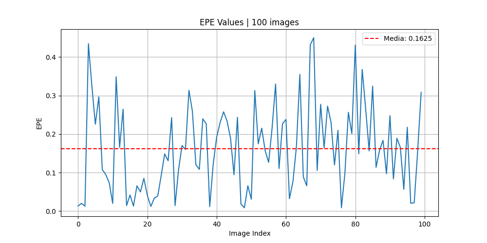
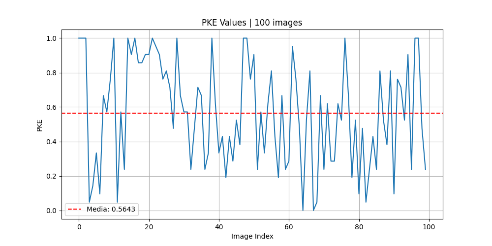
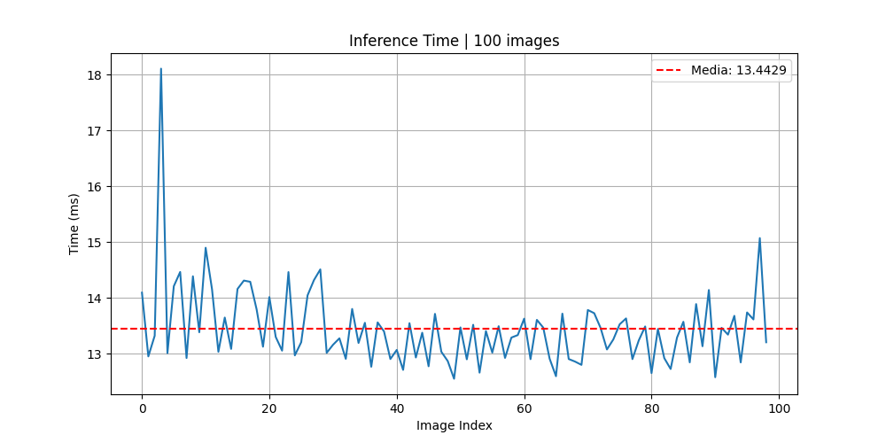

# Hand Keypoint Detection System

Acest proiect implementează un sistem avansat de detectare a punctelor cheie (keypoints) ale mâinii, utilizând o arhitectură bazată pe rețele neuronale convoluționale de tip **U-Net** îmbunătățite cu module de atenție multiscală (**MSAB**). Sistemul este capabil să identifice 21 de articulații ale mâinii în timp real.

## 🚀 Caracteristici Principale
*   **Arhitectură Hibridă**: Encoder-Decoder bazat pe U-Net cu blocuri MSAB pentru captarea detaliilor fine și globale.
*   **Antrenare Optimizată**: Utilizarea a doi optimizatori (SGD și Adam) pentru o convergență stabilă pe parcursul a 100 de epoci.
*   **Funcție de Loss Custom**: Implementarea **IoU Loss** pe heatmap-uri pentru o precizie sub-pixel.
*   **Performanță Real-Time**: Timp de inferență mediu de aproximativ **12.4 ms** (~80 FPS).

## 🏗️ Arhitectura Modelului
Modelul este compus din două secțiuni principale:
1.  **Encoder**: 4 blocuri de convoluție integrate cu două module **Multiscale Attention Block (MSAB)**. MSAB utilizează nuclee de dimensiuni diferite ($k=1, 3, 5, 7$) pentru a procesa informația la scări multiple.
2.  **Decoder**: 3 blocuri de convoluție care combină feature-maps de la rezoluții diferite ($64\times64$, $128\times128$, $256\times256$) pentru a reconstrui heatmap-urile finale.

## 📊 Date și Pre-procesare
*   **Dataset**: Aproximativ 18,776 imagini de antrenare și 7,992 imagini de testare.
*   **Augmentarea Datelor**: Pentru a crește robustețea, s-au aplicat tehnici precum:
    *   Random Motion Blur & Gaussian Blur.
    *   Random Flip & Rotate.
    *   Color Jitter.

## 📈 Rezultate și Metricii
Modelul a fost evaluat folosind trei metrici fundamentale:
*   **Mean End-to-End Point Error (EPE)**: Distanța euclidiană medie între predicție și ground-truth.
    *   *Rezultat*: Medie de **0.1625** pe 100 de imagini.
    
*   **Percentage of Correct Keypoints (PCK)**: Procentul de puncte corecte sub un prag de toleranță de 0.1.
    *   *Rezultat*: Medie de **0.5643**.
    
*   **Inference Time**: Eficiența procesării per cadru.
    *   *Rezultat*: Timp stabil de aproximativ **12.39 ms** după faza de optimizare.
    

## 🛠️ Detalii Implementare Antrenament
Antrenamentul a fost structurat pentru a asigura o tranziție lină de la învățarea globală la rafinarea detaliilor:
1.  **Epocile 1-36**: Optimizator SGD cu $lr=0.1$.
2.  **Epocile 37-65**: Optimizator Adam cu $lr=0.001$.
*   **Loss Final**: 0.3591 (Train) / 0.3788 (Validation).

## 🔗 Resurse
*   **Repository Proiect**: [mihaidanaila11/Hand-Detector](https://github.com/mihaidanaila11/Hand-Detector)
*   **Hand Detector utilizat**: [victordibia/handtracking](https://github.com/victordibia/handtracking)

---

## Bibliografie
* **Li Yang**, et al, "**A Light CNN based Method for Hand Detection and Orientation Estimation**", 2018 24th International Conference on Pattern Recognition (ICPR), Beijing, China, August 20-24, 2018
* **H Pallab Jyoti Dutta**, et al, "**Multiscale Attention-Based Hand
Keypoint Detection**", IEEE TRANSACTIONS ON INSTRUMENTATION AND MEASUREMENT, VOL. 73, 2024